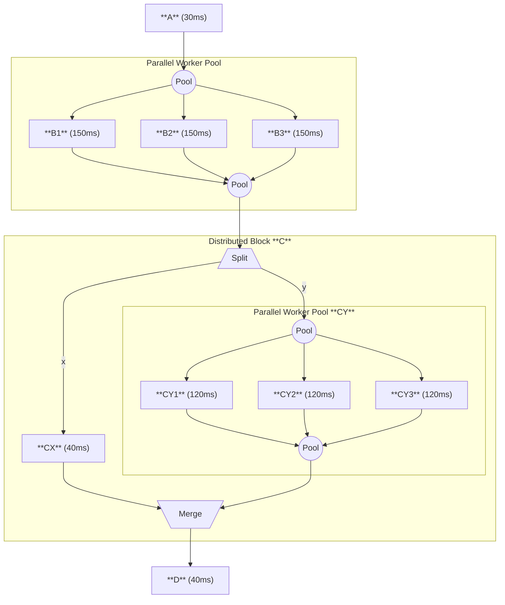

# Pipeline

Multithread python pipeline framework.

* Preserving first-in-first-out order of data.
* Supporting complex and non-linear data flow.
* Maximizing thouroughput. 
* Easy and intuitive. Minimal code to build a pipeline. 
* Suitable for IO-bound and numpy/pytorch-based applications with complex streamed data.

## Installation

```
pip install git+https://github.com/EasternJournalist/pipeline.git
```

## Supported Components

<table>
  <thead>
    <tr>
      <th>Category</th>
      <th>Component</th>
      <th>Description</th>
    </tr>
  </thead>
  <tbody>
    <!-- Basic Units -->
    <tr>
      <td rowspan="2">Basic</td>
      <td><code>Worker</code></td>
      <td>Applies a user-defined function to each input item.</td>
    </tr>
    <tr>
      <td><code>Source</code></td>
      <td>Generates data into the pipeline; usually the starting point.</td>
    </tr>
    <!-- Execution -->
    <tr>
      <td rowspan="2">Structural</td>
      <td><code>Sequential</code></td>
      <td>Pipeline of nodes in a sequential order.</td>
    </tr>
    <tr>
      <td><code>Parallel</code></td>
      <td>Runs a pool of parallel nodes.</td>
    </tr>
    <!-- Batching -->
    <tr>
      <td rowspan="4">Batching & Flow Control</td>
      <td><code>Batch</code></td>
      <td>Groups incoming items into batches of a given size, or within time of patience.</td>
    </tr>
    <tr>
      <td><code>Unbatch</code></td>
      <td>Splits batched input into individual items.</td>
    </tr>
    <tr>
      <td><code>Buffer</code></td>
      <td>Buffers items in a queue between upstream and downstream stages.</td>
    </tr>
    <tr>
      <td><code>Filter</code></td>
      <td>Filter items.</td>
    </tr>
    <!-- Routing -->
    <tr>
      <td rowspan="4">Multi-Branch Routing</td>
      <td><code>Distribute</code></td>
      <td>Takes a dictionary input and sends each value to corresponding named branch.
    </tr>
    <tr>
      <td><code>Broadcast</code></td>
      <td>Sends a copy of input to all branches.</td>
    </tr>
    <tr>
      <td><code>Switch</code></td>
      <td>Uses a key function to send data to a single selected branch.</td>
    </tr>
    <tr>
      <td><code>Router</code></td>
      <td>Uses a key function to send data to multiple selected branches.</td>
    </tr>
  </tbody>
</table>


## Example



- If processing serially, each item takes 30 + 150 + 40 + 120 + 40 = 380ms.  
- With pipeline, we can achieve the **theoretical optimal throughput of 50ms per item**.

```python
import pipeline

pipe = pipeline.Sequential([ 
    A, 
    pipeline.Parallel([B, B, B]),
    pipeline.Distribute({
      'x': CX, 
      'y': pipeline.Parallel([CY, CY, CY]), 
    }),  .
    D,
])
```

Test the full example code below:

```python
import time
import pipeline

# Define the functions of each node
def A(data):
    time.sleep(0.03)
    return data * 4 - 3

def B(data):
    time.sleep(0.15)
    return {'x': data * 2, 'y': 1}

def CX(data):
    time.sleep(0.04)
    return data ** 2

def CY(data):
    time.sleep(0.12)
    return data - 1

def D(data):
    time.sleep(0.05)
    return data['x'] + data['y']


# Build the pipeline
pipe = pipeline.Sequential([ 
    A, 
    pipeline.Parallel([B, B, B]),
    pipeline.Distribute({
      'x': CX, 
      'y': pipeline.Parallel([CY, CY, CY]), 
    }),
    D,
])

# Start the pipeline and run it
with pipe:  
    
    last_time = time.time()
    # Pass an iterable input to the pipeline and iterate over the results
    for i, result in zip(range(100), pipe(range(100))):
        now = time.time()
        print(f"No. {i}, result: {result}, throughput: {now - last_time:.4f}s/it.")
        last_time = now

    # Usage 2 - For irregularlly sourced data
    pipe.put(10)
    print(pipe.get())

    # NOTE for usage 2: 
    # If you put too many data and do not get them, 
    # the pipeline will be full, and the put operation will block until the pipeline has space to accept the data.
    # Consider putting data in a separate thread.
    # Or use a Buffer(0) node at the beginning of the sequential to hold infinite number of inputs.
```
